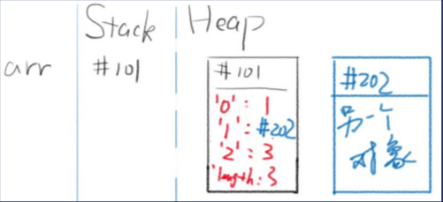
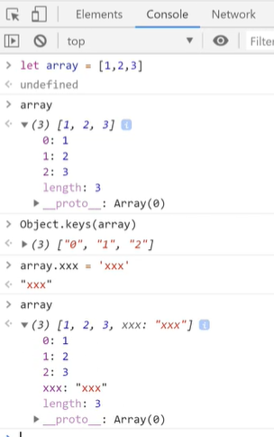
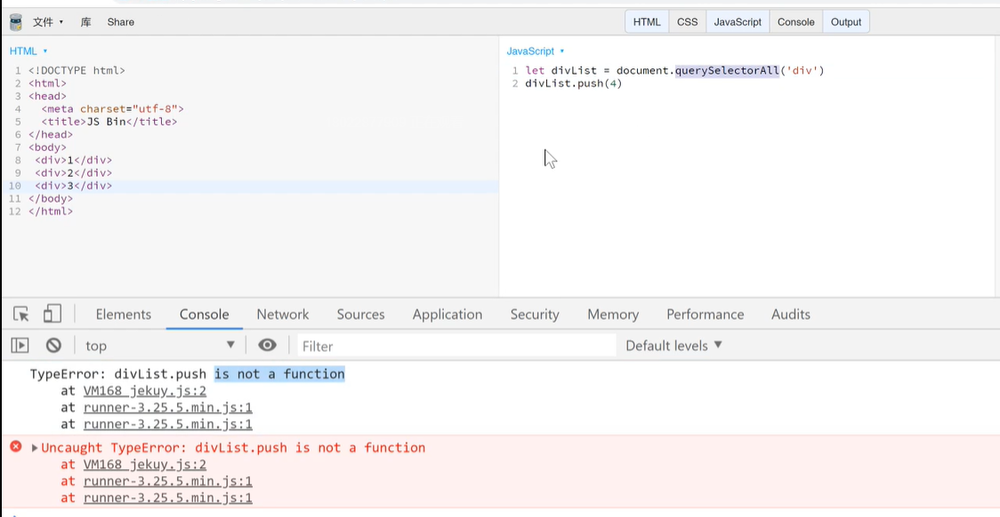
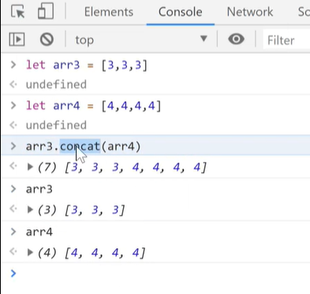
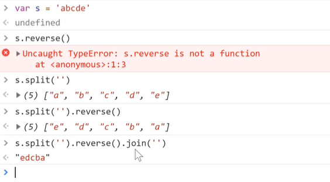
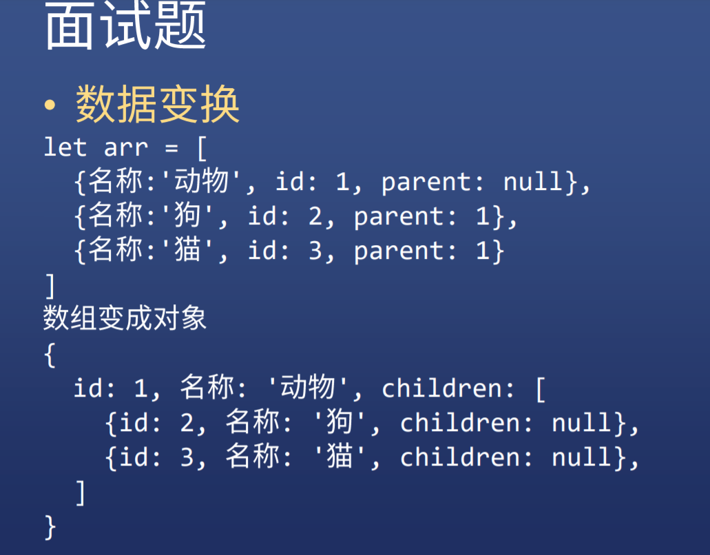

# 数组对象
* 是一种特殊的对象

## JS数组的存储
* 元素的类型可以不同
* 内存不一定是连续的（对象是随机储存的）
* 不能通过数字下标，而是通过字符串下标
* 
* 这意味着数组可以有任何key
* 
  

## 如何创建一个数组
* 新建
```JavaScript
let arr = [1,2,3]
let arr = new Array(1,2,3)
let arr = new Array(3) //表示创建长度为3的数组
```
* 转化
```JavaScript
let arr = '1,2,3'.split(',')
let arr = '123'.split('')
Array.from('123')
```
* .png) 
* Array.from()需要有0 1 2 这些数字下标 和length属性才能生成数组

* 伪数组
* * 伪数组的原型链中并没有数组的原型
```JavaScript
let divList = document.querySelectAll('div')
```


* 如果是伪数组，应该第一时间用Array.from()，变为真数组
* 

* 合并两个数组，得到新数组
* * 原本的arr1和arr2不会改变
```JavaScript
arr1.concat(arr2)
```
* 截取一个数组的一部分，截取的部分形成新数组，不会改变原有的数组
```JavaScript
arr1.slice(1) //从第二个元素开始
let arr2 = arr1.slice(0) //拷贝一个元素
```
* 注意JS只提供浅拷贝
  
## 删除和增加元素
* 删除头部
* * arr.shift()
* 头部加元素
* * arr.unshift(item1,item2)
  
* 删除尾部
* * arr.pop()
* 尾部增加元素
* * arr.push(item1,item2)

* 删除/增加中间元素
```JavaScript
arr.splice(2,1)//从第三个开始，删除一个
arr.splice(1,2,'x')//从第二个开始，删除两个元素，并在删除位置添加一个'x'
arr.splice(1,1,'x','y')//从第二个开始，删除一个元素，并在删除位置添加'x'和'y'
arr.splice(1,0,'x','y')//从第二个开始，不删除元素，添加'x'和'y'
```

## 查看数组所有的元素
* 查看数字（字符串）属性名和值
* 第一种方式for循环遍历
~~~JavaScript
for(let i = 0; i < arr.length; i++){
console.log(`${i}: ${arr[i]}`)
}
//${}表示可以在中间插变量
~~~

* 第二种方式forEach
~~~JavaScript
arr.forEach(function(item, index){
console.log(`${index}: ${item}`)
})
~~~

* 这个是forEach的原理
```JavaScript
function forEach(array, fn){
for(let i = 0; i<array.length; i++){
fn(array[i], i, array)
    }
}
//forEach用for访问array的每一项；
//对每一项调用fn(array[i], i, array)
```

* for循环遍历和arr.forEach()的区别是什么
* * for循环里面可以有break/continue，但是arr.forEach()不支持； 
* * for循环是关键字，没有函数作用域，只有block块级作用域

## 查看数组单个属性
* 和对象一样
```JavaScript
let arr=[111,222,333]
arr[0] //111
```

* 查看某个元素是否存在数组里
```JavaScript
arr.indexOf(item) 
//如果不存在返回-1
//如果存在则返回该元素的索引号
//如果该元素重复存在于数组里，则只会显示第一个的索引号
```

* 使用条件查找元素
```JavaScript
arr.find(item=>items%2===0)//找第一个偶数
arr.find(item=>items%2===0)//找第一个偶数的索引号
```  

## 修改数组中的元素
* 反转顺序
* * arr.reverse()
  
<strong>面试题：怎么让一个字符串调换顺序？</strong>

```JavaScript
var s = 'abcde'
s.split('').reverse().join('')
```


* 自定义排序
* * arr.sort((a,b)=>a-b)
.png) 

## 数组变换
* map()一一对应 n变n
```JavaScript
let arr= [11,22,25,7,9]
rr.map(item=>item*item) //[121, 484, 625, 49, 81]
```
```JavaScript
let arr = [0,1,2,2,3,3,3,4,4,4,4,6]
let arr2 = arr.map(补全代码)
console.log(arr2) // ['周日', '周一', '周二', '周二', '周三', '周三', '周三', '周四', '周四', '周四', '周四','周六']

let arr2 = arr.map(item=>{
    let week = ['周日', '周一', '周二', '周三', '周四','周五','周六']
    return week[item]
})
```
* filter() 过滤 n变少
```JavaScript
let arr= [11,22,25,7,9]
arr.filter(item=>item%2===0? true:false) //[22]
如果是偶数，true留下，false不用
```

* reduce() n变1
```JavaScript
let arr= [11,22,25,7,9]
arr.reduce((sum,item)=>{return sum+item},0) //77
//arr.reduce((sum,item)=>{return sum+item},初始值)，遍历返回初始值和元素相加的和
```
```JavaScript
let arr = [1,2,3]
arr.reduce((result,item)=>{return result.concat(item*item)},[])//[1, 4, 9]
```
```JavaScript
let arr = [1,2,3,4,5,6]
arr.reduce((result,item)=>{
    if(item%2===0){return result.concat(item)}
    else{return result}
},[])

arr.reduce((result,item)=>
    item%2===0? result.concat(item):
    result
,[])
```

## 面试题

```JavaScript
let arr = [
{ 名称:'动物 ', id: 1, parent: null},
{ 名称:' 狗', id: 2, parent: 1},
{ 名称:' 猫', id: 3, parent: 1}
]
转变成
{
    id: 1, : '动物 ', children: [
        {id: 2, : ' 狗', children: null},
        {id: 3, : '猫 ', children: null},
    ]
}
```
```JavaScript
arr.reduce((result,item)=>{
    if(item.parent===null){
        result.id=item.id;
        result['名称']=item['名称']
}else{
    result.children.push(item);
    delete item.parent;
    item.chidren = null
}
return result
},{id:null,children:[]})
```