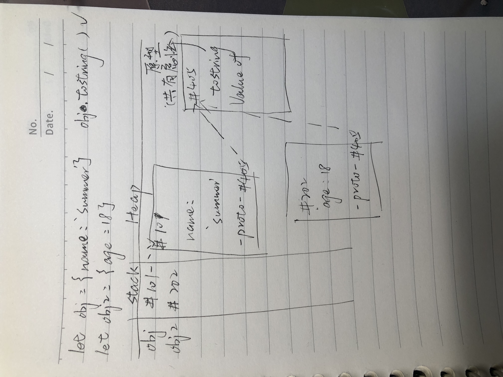
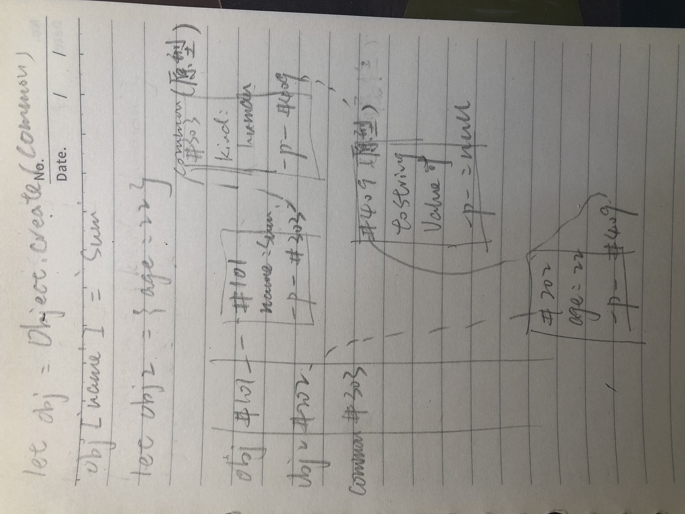
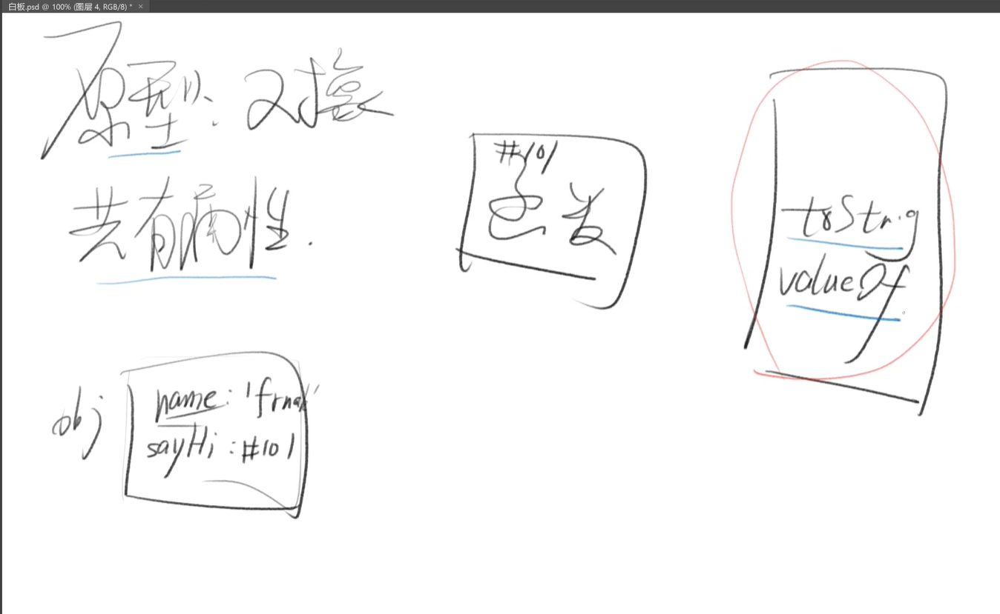

## 定义
* 无序的数据集合
* 键值对的集合

<br>

## 写法
* let obj = { 'name': 'frank', 'age': 18 }
* let obj = new Object({'name': 'frank'})
* console.log({ 'name': 'frank, 'age': 18 })
* 注意：{ 'name': 'frank, 'age': 18 } 没有console.log的时候不是对象，而是label标签

## 细节
* 键名是字符串，不是标识符，可以包含任意字符
* 引号可省略，省略之后就只能写标识符
* 就算引号省略了，**键名也还是字符串（重要）**
* Object.keys(obj) 可以得到 obj 的所有 key
* 每个 key 都是对象的属性名（property）
* 每个 value 都是对象的属性值


## 如何让变量作属性名
* 之前都是用常量做属性名
```
let p1 = 'name'
let obj = { p1 : 'frank'} 这样写，属性名为 'p1'
let obj = { [p1] : 'frank' } 这样写，属性名为 'name'
```

~~~JavaScript
var a = xxx;
var obj ={
    a:111
}
obj // {'a':111}

var a = xxx;
var obj ={
    [1+2+3]:'六'
}
obj // {'6':六}
~~~

### 对比
* 不加 [ ] 的属性名会自动变成字符串
* 加了 [ ] 则会当做变量求值
* 值如果不是字符串，则会自动变成字符串 


## 对象的隐藏属性
* 隐藏属性
* JS 中每一个对象都有一个隐藏属性
* 这个隐藏属性储存着其共有属性组成的对象的地址
* 这个共有属性组成的对象叫做原型
* 也就是说，隐藏属性储存着原型的地址



## 删除属性
* delete obj.xxx 或 delete obj['xxx']

~~~JavaScript
var obj ={
    name:'sum',
    age:22
}

obj.name = undefined;
console.log(obj) // {'name':undefined,age:22},只是把name的值设置为undefined

var obj ={
    name:'sum',
    age:22
}

delete obj.name
console.log(obj) // {age:18}，把属性名和属性值都删除了
~~~

* 如何判断有没有name属性名<br>
'name' in obj === false;

* 如何判断有属性名，只是值为undefined<br>
'name' in obj && obj.name === undefined

* 注意 obj.xxx === undefined<br>
不能断定 'xxx' 是否为 obj 的属性

## 'name' in obj和obj.hasOwnProperty('name') 的区别
* 'name' in obj 只是检查这个属性是否在obj对象上，但是不会判断这个属性是自身的属性还是隐藏的共有属性
* obj.hasOwnProperty('name') 会判断'name'这个属性只是自身的属性

<br>

## 查看属性
* 中括号语法：obj['key'] 
* 点语法：obj.key
* 坑新人语法：obj[key] // 变量 key 值一般不为 'key'</n>

    <strong>obj.name 等价于 obj['name']<br>
    obj.name 不等价于 obj[name]<br>
    简单来说，这里的 name 是字符串，而不是变量<br>

    let name = 'frank'<br>
    obj[name] 等价于 obj['frank']<br>
    而不是obj['name'] 和 obj.name
</strong>

~~~JavaScript
let list = ['name', 'age', 'gender']
let person = {
       name:'frank', age:18, gender:'man'}
for(let i = 0; i < list.length; i++){
  let name = list[i]
  console.log(person__???__)
}
使得 person 的所有属性被打印出来
1.console.log(person.name)
2.console.log(person[name])

答案是2 ,因为person.name = person['name'], 得到的永远是字符串'name';而person[name]，得到的是name这个变量
~~~


## 修改或增加属性（写属性）
* let obj = {name: 'frank'} // name 是字符串
* obj.name = 'frank' // name 是字符串
* obj['name'] = 'frank' 
* obj[name] = 'frank' // 错，因 name 值不确定
* obj['na'+'me'] = 'frank'
* let key = 'name'; obj[key] = 'frank'
* let key = 'name'; obj.key = 'frank' // 错
* 因为 obj.key 等价于 obj['key']

## 批量赋值
Object.assign(obj, {age: 18, gender: 'man'})

## 修改或增加共有属性
* 无法通过自身修改或增加共有属性
* let obj = {}, obj2 = {} // 共有 toString
* obj.toString = 'xxx' 只会在改 obj 自身属性
* obj2.toString 还是在原型上

## 修改自身的隐藏属性
* 推荐使用 Object.create
~~~JavaScript
let obj = Object.create(common)
obj.name = 'frank'

规范大概的意思是，要改就一开始就改，别后来再改
~~~
* 只是修改了自身的隐藏属性，而不会影响其他变量的原型
* 

## 总结
* 删
 ~~~JavaScript
delete obj['name']
'name' in obj // false
obj.hasOwnProperty('name')  // false
~~~
* 查
~~~JavaScript
Object.keys(obj)
console.dir(obj)
obj['name']
obj.name // 记住这里的 name 是字符串
obj[name]  // 记住这里的 name 是变量
~~~

* 改
~~~JavaScript
改自身 obj['name'] = 'jack'
批量改自身 Object.assign(obj, {age:18, ...})
改共有属性 obj.__proto__['toString'] = 'xxx'
改共有属性 Object.prototype['toString'] = 'xxx'
改原型 obj.__proto__ = common
改原型 let obj = Object.create(common)
注：所有 __proto__ 代码都是强烈不推荐写的
~~~
* 增
基本同上：已有属性则改；没有属性则增。

* 原型是对象，共有属性是属性
    * 原型是下图红色框区域，是一个对象
    * 共有属性是原型里面的tostring/ valueof
  


